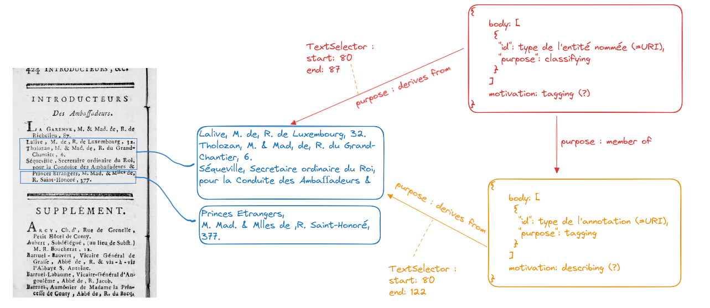
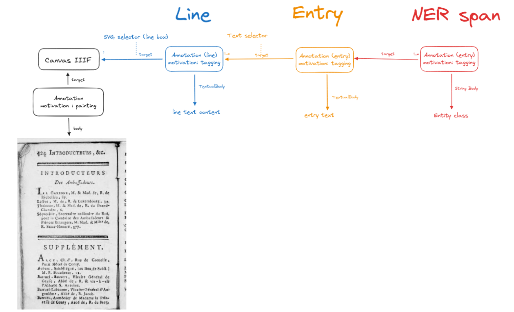

# WG-data_model
Working group on the data model for Mezanno 

## Comportement par défaut de MIRADOR
- pour chaque annotation, il y a une entrée (potentiellement vide mais cliquable dans la liste des annotations)
- si la target a un sélecteur et que le canevas pointé est affichée, le sélecteur est affiché sur le canevas, et mis en surbrillance si on sélectionne l'annotation
- si le body contient un TextualBody, le contenu textuel est affiché dans la liste d'annotations

## vision du modèle d'annotation au regard de processus d'interprétation
- target = lien à la source (input du process)
- body = nouvelle connaissance produite (output du process)

# Essais de modélisations des annotations

Un modèle simple pour découpler le modèle physique du document (fragments de texte) et le modèle métier (restructuration & sémantisation)

Expérimentation 'manifest_chained_annotations.json'

## Display some results

Except from SODUCO data
<https://directory.geohistoricaldata.org/?manifest=https://raw.githubusercontent.com/mezanno/WG-data_model/main/annotations_experiments/manifest_soduco.json>

Chained annotation
<https://directory.geohistoricaldata.org/?manifest=https://raw.githubusercontent.com/mezanno/WG-data_model/main/annotations_experiments/manifest_chained_annotations.json>

# Ressources : 
Web Annotation Data Model : https://www.w3.org/TR/annotation-model/
IIIF Presentation specification :  https://iiif.io/api/presentation/3.0/

- https://iiif.io/api/presentation/3.0/#values-for-motivation
- https://www.w3.org/TR/annotation-model/#motivation-and-purpose
- https://www.w3.org/TR/annotation-vocab
- 

